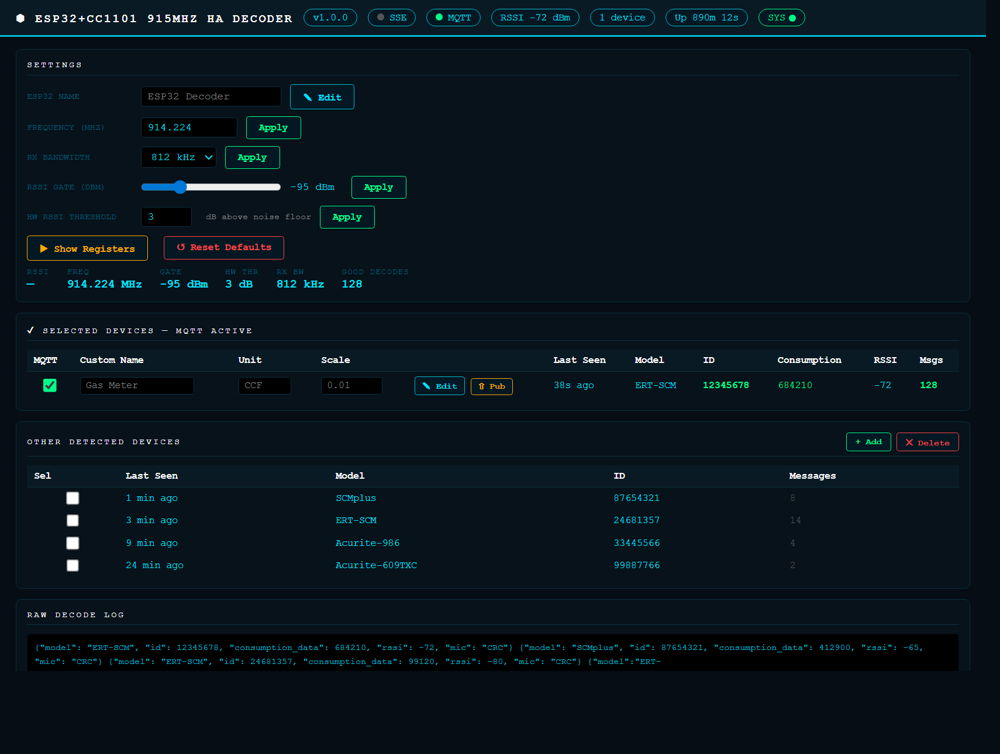

# 📡 ESP32-S3 + CC1101 — Itron ERT Meter → Home Assistant

> A **wide-band** 915 MHz **Itron ERT** utility-meter reader (gas / water / electric) on an
> **ESP32-S3 + CC1101**, streaming live consumption into **Home Assistant**.


> 🔗 **Companion project:** using a Heltec LoRa board (ESP32 + SX1276) instead?
> See **[Heltec V2 (SX1276) version →](https://github.com/Xieo/Heltec-V2-SX1276-ERT-Decoder)**



---

## ✨ What it does
- 📶 Decodes **Itron ERT** SCM / SCMplus / IDM meters with [rtl_433](https://github.com/merbanan/rtl_433)
- 🌐 **Wide RX bandwidth** (CC1101 ~812 kHz) covers the whole ERT band at once — no need to park on an exact channel
- 🖥️ Clean **web dashboard** to choose which meters to forward
- 🏠 **Home Assistant** auto-discovery over MQTT + 🔄 **OTA** updates

---

## 🛠️ Requirements
| Item | Notes |
|------|-------|
| ESP32-S3 dev board | e.g. `esp32-s3-devkitc-1` |
| CC1101 915 MHz module | wired CS=10, GDO0=4, GDO2=5, SCK=9, MISO=13, MOSI=11 |
| 915 MHz antenna | |
| MQTT broker + Home Assistant | e.g. the Mosquitto add-on |
| [PlatformIO](https://platformio.org/install) | VS Code extension or CLI |

---

## 🚀 Quick start

**1. Get the code**
```bash
git clone https://github.com/Xieo/ESP32-S3-CC1101-ERT-Decoder.git
cd ESP32-S3-CC1101-ERT-Decoder
```

**2. Configure** — copy the template, then fill in your Wi-Fi + MQTT details:
```bash
cp src/Credentials.h.example src/Credentials.h
```

**3. Flash over USB**
```bash
pio run -e s3-usb -t upload
```

**4. Open `http://<board-ip>/`**, find your meter under **Other Detected Devices**, and click
**➕ Add** — it now appears in Home Assistant.

> **Wi-Fi updates:** set your board's IP under `[env:s3-wifi]` in `platformio.ini`, then
> `pio run -e s3-wifi -t upload`.

---

## 🎛️ Dashboard
| Section | Purpose |
|---------|---------|
| **Other Detected Devices** | Everything currently on the air — **➕ Add** to track one. |
| **Selected Devices** | Tracked meters: set a **name / unit / scale**, **Save**, or **Pub** to push the latest reading immediately. |

Tracked meters auto-publish on every decode and appear in Home Assistant as a device with a
**consumption** sensor and an **RSSI** diagnostic sensor.

---

## 🙏 Credits
[rtl_433](https://github.com/merbanan/rtl_433) · [NorthernMan54/rtl_433_ESP](https://github.com/NorthernMan54/rtl_433_ESP)

> Read only meters you are authorized to. ERT is unencrypted utility telemetry — check your local rules.
